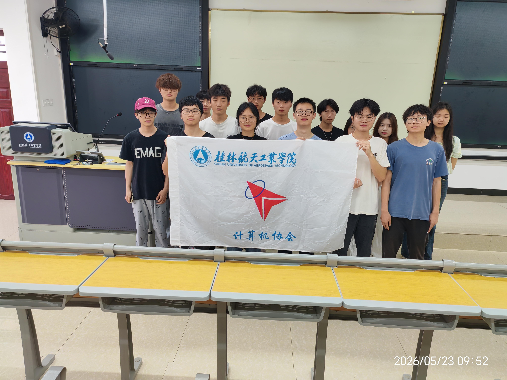

# 计算机协会招新网站 · 维护文档

> 2026 秋季招新 | HTML + CSS + JavaScript | 深色/浅色双主题 | 最后更新：2026-08-17

---

## 📁 文件结构

```
F:\练习\计协招新\
├── index.html      (705 行)  HTML 结构
├── styles.css      (1746 行) 全局样式 + 响应式 + 双主题
├── script.js       (451 行)  交互逻辑
├── README.md                本文件
└── assets/                  静态资源
    ├── emblem1.png          协会会徽 ✅
    ├── emblem.jpg           备用会徽
    ├── fengmao.jpg          活动卡片图（计协风貌）
    ├── peixun.JPG           活动卡片图（技术培训）
    ├── huodong.jpg          活动卡片图（计协活动）
    ├── qq qun.png           QQ群二维码 ✅
    └── （报名表二维码）       ★ 待补充
```

---

## 🎨 设计系统

### 配色方案

| 变量 | 深色模式 | 浅色模式 | 用途 |
|------|---------|---------|------|
| `--bg-primary` | `#0A0E1A` | `#F8FAFC` | 页面背景 |
| `--bg-secondary` | `#111827` | `#F1F5F9` | 区块背景 |
| `--bg-card` | `#1A1F35` | `#FFFFFF` | 卡片背景 |
| `--text-primary` | `#F1F5F9` | `#0F172A` | 标题文字 |
| `--text-secondary` | `#94A3B8` | `#475569` | 正文文字 |
| `--text-muted` | `#8290A8` | `#5A6B82` | 辅助文字（已提亮至 AA） |
| `--accent-blue` | `#4F6EF7` | 同 | 主品牌色 |
| `--accent-purple` | `#8B5CF6` | 同 | 辅品牌色 |
| `--accent-cyan` | `#22D3EE` | 同 | 高亮色 |
| `--accent-amber` | `#F59E0B` | 同 | 强调色 |
| `--gradient-brand` | `#3F5BE0→#7C4EEC` | 同 | 主 CTA 按钮渐变（白字达标） |
| `--border` | `#1E293B` | `#E2E8F0` | 边框 |
| `--border-light` | `#334155` | `#CBD5E1` | 亮边框 |

> **规则**：CSS 中始终使用 `var(--xxx)` 引用颜色，避免硬编码。如需添加新颜色，先在 `:root` 和 `[data-theme="light"]` 中定义变量。

### 字体

| 用途 | 字体 | 备选 |
|------|------|------|
| 标题 (h1-h6) | Space Grotesk | system-ui, sans-serif |
| 正文 (p, body) | DM Sans | system-ui, -apple-system, sans-serif |

> Google Fonts 引入，已在 `<head>` 中加载。如需更换，修改 `index.html` 第 12 行的 URL 和 CSS 中的 `font-family`。

### 间距与圆角

| 变量 | 值 | 用途 |
|------|-----|------|
| `--radius-sm` | 8px | 小图标、标签 |
| `--radius` | 12px | 按钮、FAQ |
| `--radius-lg` | 16px | 卡片 |
| `--radius-xl` | 24px | CTA 大卡片 |
| `--max-width` | 1200px | 内容区最大宽度 |
| `--nav-height` | 72px | 导航栏高度 |

---

## 📄 页面区块

| 区块 | id | 功能 |
|------|-----|------|
| 导航栏 | `#navbar` | 固定顶部，滚动后毛玻璃效果，移动端汉堡菜单 |
| Hero | `#hero` | 全屏，Canvas 粒子背景，会徽区域，双 CTA |
| 关于我们 | `#about` | 左：三张特色卡片；右：协会介绍 + 特点列表 |
| 部门介绍 | `#departments` | Bento Grid 5 张部门卡片（科研/宣传/办公室/管理/外联） |
| 数据统计 | `#stats` | 4 项社团数据（成员/荣誉/服务人数/活动），滚动数字动画 |
| 精彩活动 | `#events` | 3 张活动卡片（计协风貌/技术培训/计协活动），带真实照片 |
| 加入流程 | `#process` | 4 步时间线，圆形步骤编号 |
| 常见问题 | `#faq` | 5 个独立折叠面板，可同时展开多条 |
| CTA Banner | `#cta` | 报名号召 + 双按钮 |
| Footer | `#footer` | 四栏网格，会徽，社交媒体图标 |
| 二维码弹窗 | `#qrModal` | 点击报名按钮弹出，QQ群 + 报名表二维码 |
| 二维码放大层 | `#qrZoomOverlay` | 双击弹窗内二维码全屏放大，便于扫码 |
| 回到顶部 | `#backToTop` | 滚动超过 600px 显示 |

---

## 🔧 常见修改指南

> 所有修改只需编辑 `index.html`（改内容）、`styles.css`（改样式）、`script.js`（改行为）。
> 每个区块都有 `<section id="xxx">` 或注释分隔线 `<!-- ==== XXX ==== -->`，搜索即可定位。

---

### 1. 导航栏

**改链接文字和顺序：**

```html
<ul class="nav-links">
    <li><a href="#about" onclick="scrollToSection(event, 'about')">关于我们</a></li>
    <!-- 增加链接：复制一行，改 href 和文字 -->
    <!-- 删除链接：删除整行 <li> -->
    <!-- 改顺序：拖动 <li> 整行到目标位置 -->
</ul>
```

**改 CTA 按钮文字：**

```html
<button class="nav-cta" onclick="scrollToSection(event, 'cta')">
    立即加入   <!-- ← 改这里 -->
</button>
```

**移动端菜单同步修改：** 找到 `id="mobileNav"` 的 div，里面的链接需要和桌面端保持一致。

**改导航栏高度：** 改 `styles.css` 中 `:root { --nav-height: 72px; }`，滚动偏移量会自动适配。

---

### 2. Hero 区域

**改徽章文字：**

```html
<div class="hero-badge">
    <span class="hero-badge-dot" aria-hidden="true"></span>
    2026 秋季招新正式启动   <!-- ← 改这里 -->
</div>
```

**改主标题：**

```html
<h1 class="hero-title">
    用代码改变世界<br>           <!-- ← 第一行 -->
    <span class="hero-title-gradient">从这里开始</span>  <!-- ← 渐变高亮行 -->
</h1>
```
> 不需要换行就去掉 `<br>`。渐变行保持用 `<span class="hero-title-gradient">` 包裹。
> 标语基调为"改变世界/精彩不止一面"，改动时保持与 Footer 品牌标语同步。

**改副标题：**

```html
<p class="hero-subtitle">
    计算机协会是校园计算机爱好者聚集地。如果你对计算机感兴趣...   <!-- ← 直接改文字 -->
</p>
```

**改 CTA 按钮：**

```html
<div class="hero-actions">
    <button class="btn btn-primary" onclick="scrollToSection(event, 'cta')">
        立即报名   <!-- ← 主按钮文字 -->
    </button>
    <button class="btn btn-secondary" onclick="scrollToSection(event, 'departments')">
        了解部门   <!-- ← 次按钮文字；改 onclick 里的 section id 可换跳转目标 -->
    </button>
</div>
```

**改/删滚动指示器：**

```html
<div class="hero-scroll-indicator" onclick="scrollToSection(event, 'about')" ...>
    <span>探索更多</span>   <!-- ← 改文字 -->
</div>
```
> 不需要就删除整个 `<div class="hero-scroll-indicator">`。

---

### 3. 会徽（三个位置同步）✅ 已完成

当前使用 `assets/emblem1.png`，已在导航栏、Hero、Footer 三处生效。如需更换为新版本：

1. 将新会徽放入 `assets/` 目录
2. 全局搜索 `emblem1.png` 替换为新文件名（共 3 处：导航栏、Hero、Footer）
3. 或直接覆盖 `assets/emblem1.png`，无需改代码

| 位置 | 尺寸 | CSS 选择器 |
|------|------|-----------|
| 导航栏左侧 | 36×36px 圆形 | `.nav-logo-icon` |
| Hero 标题上方 | 100~220px 响应式圆形 | `.hero-emblem` |
| Footer 品牌区 | 36×36px 圆形 | `.nav-logo-icon` |

> 图片加载失败时自动显示代码图标 `< / >` 占位。

---

### 4. 关于我们

**改标题和描述：**

```html
<span class="section-tag">关于我们</span>                    <!-- ← 小标签 -->
<h2 class="section-title">计算机协会，精彩不止一面</h2>       <!-- ← 标题 -->
<p class="about-lead">计算机协会成立于2015年，是学校最具影响力的科技社团之一...</p> <!-- ← 引导段 -->
<p>在这里，你不仅能学到前沿技术，更能结识志同道合的伙伴...</p>     <!-- ← 第二段 -->
```
> 简介文案以社团简介为准（见宣传册 docx / xuanchuan2_preview.md），更新时保持与 Hero/Footer 标语同一基调。

**改三张特色卡片：** 每张卡片由图标 + 标题 + 描述组成，当前为协会的三大特色方向：

```html
<div class="about-card">
    <div class="about-card-icon purple">    <!-- purple/cyan/blue 控制图标颜色 -->
        <svg>...</svg>                       <!-- ← 可替换为其他 SVG 图标 -->
    </div>
    <div>
        <h4>社会实践</h4>                    <!-- ← 卡片标题：社会实践/技术分享/社团活动 -->
        <p>志愿服务 / 社区共建 / 公益宣传 / 社会调研</p> <!-- ← 卡片描述 -->
    </div>
</div>
```
> 颜色选项：`purple`（紫）、`cyan`（青）、`blue`（蓝）。如需新颜色，在 `styles.css` 中搜 `.about-card-icon` 追加。

**改下方三个特点（零基础友好/项目驱动/竞赛机会）：**

```html
<div class="about-feature">
    <div class="about-feature-icon">
        <svg>...</svg>    <!-- 对勾图标，一般不用改 -->
    </div>
    <div class="about-feature-text">
        <h4>零基础友好</h4>
        <p>从零开始的培训体系，手把手带你开启精彩旅程</p>
    </div>
</div>
```
> 三个特点对应三条成长路径：零基础入门 / 项目实战 / 竞赛历练。

---

### 5. 部门卡片（Bento Grid）

**卡片结构模板（5 张卡片，对应宣传册的五个部门）：**

```html
<div class="bento-card reveal" style="--card-accent: var(--accent-blue);">
    <div class="bento-icon research">        <!-- 图标：research/publicity/office/management/liaison -->
        <svg>...</svg>
    </div>
    <h3>科研部</h3>                           <!-- ← 部门名称 -->
    <p>负责计算机软硬件的维护和技术支持，组织技术培训和讲座...</p>  <!-- ← 部门描述（以社团简介职责为准） -->
    <div class="bento-tags">
        <span class="bento-tag">软硬件维护</span>  <!-- ← 职责标签 -->
        <!-- 增加标签：加一行 span -->
    </div>
</div>
```

**卡片尺寸：** 5 张卡片均为普通 `bento-card`（桌面 5 列、1024px 3 列、768px 2 列、手机 1 列），不使用 `large`/`wide` 变体。

**改卡片强调色：** `style="--card-accent: var(--accent-blue);"` 中的颜色变量：
- `var(--accent-blue)` — 蓝（科研部）
- `var(--accent-purple)` — 紫（宣传部）
- `var(--accent-amber)` — 金（办公室）
- `var(--accent-cyan)` — 青（管理部）
- `#EC4899` — 粉（外联部）

**图标颜色选项（改 `bento-icon` 后面的类）：**
`research` / `publicity` / `office` / `management` / `liaison`（与五个部门一一对应）

---

### 6. 数据统计

**结构模板（4 个统计项）：**

```html
<div class="stats-grid">
    <div class="stat-item reveal">
        <div class="stat-number" data-count="80">0</div>   <!-- ← 目标值写在 data-count -->
        <div class="stat-label">协会成员</div>             <!-- ← 标签文字 -->
    </div>
    <!-- 复制 .stat-item 增删统计项 -->
</div>
```

**改数字：** 只改 `data-count` 属性（初始显示值 `0` 不用动）。滚动到统计区时自动播放数字动画并加 `+` 后缀（见 `script.js` 的 `animateCounters()`）；非数字值（如"十佳社团"）直接显示原文。

**当前 4 项：** 协会成员 80+ / 社团荣誉（十佳社团）/ 服务人数 500+ / 累计活动 30+

**增删统计项：** 复制/删除整个 `.stat-item`。4 项以上需在 `styles.css` 的 `.stats-grid` 中调整 `grid-template-columns`。

---

### 7. 活动卡片

**卡片结构模板（当前三张活动均已放入真实照片）：**

```html
<div class="event-card reveal">
    <div class="event-image hackathon">      <!-- hackathon/techtalk/bootcamp 控制兜底渐变 -->
        
        <div class="event-img-fallback">     <!-- 图片加载失败时显示 -->
            <svg>...</svg>
            <span>点击添加图片</span>
        </div>
    </div>
    <div class="event-body">
        <div class="event-date">2026.10.15 · 每学期一次</div>   <!-- ← 日期和频次 -->
        <h3>计协风貌</h3>                                       <!-- ← 活动名称 -->
        <p>48小时极限编程挑战，组队完成创意项目...</p>             <!-- ← 活动描述 -->
        <span class="event-tag competition">竞赛</span>          <!-- ← 标签：workshop/competition/talk -->
    </div>
</div>
```

**当前三张卡片：**

| 卡片 | 图片 | 日期 |
|------|------|------|
| 计协风貌 | `assets/fengmao.jpg` | 2026.10.15 · 每学期一次 |
| 技术培训 | `assets/peixun.JPG` | 2026.09.20起 · 每周五晚 |
| 计协活动 | `assets/huodong.jpg` | 2026.11.01 · 持续4周 |

**换照片：** 将新图片放入 `assets/`，替换 `src`（比例 16:10 效果最佳，`object-fit: cover` 自动裁切）。图片加载失败时自动显示渐变背景 + SVG 图标占位，无需额外处理。

> 线上部署时建议压缩图片（当前三张为 6~12MB，推荐转 WebP 至 < 100KB），避免影响加载速度。

**标签颜色选项（改 `event-tag` 后面的类）：**
- `competition` — 金色（竞赛）
- `workshop` — 蓝色（工作坊）
- `talk` — 紫色（讲座）

---

### 8. 加入流程

**改步骤：**

```html
<div class="process-step reveal">
    <div class="step-number">01</div>          <!-- ← 步骤编号 -->
    <h3>在线报名</h3>                          <!-- ← 步骤标题 -->
    <p>填写报名表，选择你感兴趣的部门方向</p>    <!-- ← 步骤描述 -->
</div>
```

**增删步骤：** 复制/删除整个 `.process-step` div。步骤之间的连接线在 `styles.css` 的 `.process-steps::before` 中定义。超过 4 步需调整 `grid-template-columns`。

---

### 9. FAQ（常见问题）

**完整模板：**

```html
<div class="faq-item reveal">
    <button class="faq-question" onclick="toggleFAQ(this)" aria-expanded="false">
        <span>这里写问题？</span>
        <span class="faq-icon" aria-hidden="true">
            <svg width="16" height="16" viewBox="0 0 24 24" fill="none"
                 stroke="currentColor" stroke-width="2.5" stroke-linecap="round">
                <line x1="12" y1="5" x2="12" y2="19"/>
                <line x1="5" y1="12" x2="19" y2="12"/>
            </svg>
        </span>
    </button>
    <div class="faq-answer">
        <div class="faq-answer-inner">
            这里写答案。答案高度由 JS 自动计算，支持任意长度。
        </div>
    </div>
</div>
```

| 操作 | 方法 |
|------|------|
| **新增** | 在 `.faq-list` 末尾粘贴模板，改问答文字 |
| **修改** | 找到对应条目，直接编辑 `<span>` 和 `faq-answer-inner` 内的文字 |
| **删除** | 删除整个 `.faq-item` div |
| **排序** | 拖动 `.faq-item` 整块到目标位置 |

> **注意**：`toggleFAQ(this)` 不可删除或改名；答案高度 JS 自动计算；特殊字符（`"` `<` `>` `&`）需用 HTML 实体转义。
>
> **折叠行为**：各条目**独立折叠**——点击某条只切换该条，不影响其他条，可同时展开多条答案便于对比。

---

### 10. CTA Banner

```html
<span class="section-tag">加入我们</span>
<h2>准备好开启技术之旅了吗？</h2>         <!-- ← 标题 -->
<p>2026秋季招新现已启动...</p>            <!-- ← 描述 -->

<!-- 主按钮 -->
<button class="btn btn-primary" onclick="handleJoin()">
    立即报名                              <!-- ← 改文字 -->
</button>
<!-- 次按钮 -->
<button class="btn btn-secondary" onclick="handleMoreInfo()">
    咨询详情                              <!-- ← 改文字 -->
</button>
```

> `handleJoin()` 触发二维码弹窗，`handleMoreInfo()` 跳转到 FAQ。如需改为跳转其他位置，改 `script.js` 中对应函数。

---

### 11. 二维码弹窗

```html
<div class="modal-overlay" id="qrModal" ...>
    <div class="modal-content">
        <span class="section-tag">扫码报名</span>          <!-- ← 弹窗标签 -->
        <h2 class="modal-title">加入计算机协会</h2>         <!-- ← 弹窗标题 -->
        <p class="modal-desc">扫描下方二维码...</p>         <!-- ← 弹窗描述 -->

        <!-- 左：QQ群二维码（已放入真实图片） -->
        <div class="qr-card">
            <div class="qr-placeholder has-image">
                
                <svg>占位图标</svg><span>QQ群二维码</span><small>占位图 · 后续替换</small>
                <!-- ↑ 图片加载失败时自动回退显示占位内容 -->
            </div>
            <h4>招新QQ群</h4>
            <p>扫码加入2026招新群，获取最新通知 · 双击二维码可放大</p>
        </div>

        <!-- 右：报名表二维码（★ 待替换为真实二维码，结构与左相同） -->
        <div class="qr-card">...</div>

        <p class="modal-footer-text">报名截止：2026年9月30日...</p>  <!-- ← 底部提示 -->
    </div>
</div>
```

**双击放大二维码（便于扫码）：**

- 双击任意 `.qr-placeholder img` → 弹出全屏放大层 `#qrZoomOverlay`（白底大图，z-index 300）
- 关闭方式：点击任意位置 / 右上角 ✕ / `Esc`；关闭报名弹窗时自动连带关闭
- 放大层样式在 `styles.css` 搜 `.qr-zoom`，逻辑在 `script.js` 搜 `openQRZoom`
- 报名表二维码补图后自动生效（监听所有 `.qr-placeholder img`）

---

### 12. Footer

**改品牌标语：**

```html
<div class="footer-brand">
    <a href="#hero" class="nav-logo">...</a>
    <p>用行动改变世界，从这里开始。<br>计算机协会，精彩不止一面。</p>
    <!-- ↑ 改这里 -->
</div>
```
> 标语需与 Hero 主标题保持同一基调（"用代码改变世界，从这里开始"）。

**改导航链接：** 在 `<ul class="footer-links">` 中增删 `<li>`，和导航栏保持一致。

**改联系信息：**

```html
<li class="footer-contact-row">
    <svg>邮件图标</svg>
    csa@university.edu.cn          <!-- ← 改邮箱 -->
</li>
<li class="footer-contact-row">
    <svg>位置图标</svg>
    学生活动中心 302               <!-- ← 改地址 -->
</li>
<li class="footer-contact-row">
    <svg>时钟图标</svg>
    每周五 18:00-21:00             <!-- ← 改开放时间 -->
</li>
```

**改社交媒体链接：**

当前四个图标的处理方式不同，需分类对待：

| 图标 | 当前行为 | 修改方式 |
|------|---------|---------|
| QQ / 微信 | 点击触发 `onclick="openQRModal()"` 弹出二维码弹窗（群入口本就扫码） | 若直接加群，改 `onclick` 为真实加群链接跳转；保留弹窗则保持现状 |
| GitHub / Bilibili | 真实外链 `target="_blank" rel="noopener noreferrer"` | 把 `href` 改为协会账号真实地址 |

```html
<!-- QQ/微信：点击弹二维码弹窗 -->
<a href="#" aria-label="加入QQ群（扫码）" title="QQ群"
   onclick="event.preventDefault(); openQRModal();">
    <svg>QQ图标</svg>
</a>
<!-- GitHub/B站：真实外链，新标签打开 -->
<a href="https://github.com" target="_blank" rel="noopener noreferrer"
   aria-label="GitHub（在新标签打开）" title="GitHub">
    <svg>GitHub图标</svg>
</a>
```

> **注意：** 所有图标必须带 `aria-label`，新标签外链必须带 `rel="noopener noreferrer"`（安全）。

**增删社交图标：** 复制/删除 `<a>` 标签。图标 SVG 来自 Simple Icons 或 Heroicons。改 `aria-label` 和 `title` 为对应平台名。

---

### 13. 主题

- **默认深色**：`script.js` 中无 `localStorage` 且系统无偏好时默认深色
- **强制默认浅色**：在 `script.js` 主题切换代码中，将初始状态改为始终 `light`
- **禁用浅色模式**：删除 `styles.css` 中所有 `[data-theme="light"]` 规则块
- **粒子背景**：颜色随主题自动切换（浅色用更低明度+更高不透明度），切换主题时无需手动调整
- **改某颜色**：修改 `:root`（深色）或 `[data-theme="light"]`（浅色）中对应的 CSS 变量

---

### 14. 其他

**改页面标题（浏览器标签页）：**

```html
<title>计算机协会 · 2026招新</title>   <!-- ← 改这里 -->
```

**改 SEO 描述：**

```html
<meta name="description" content="计算机协会招新 - 加入我们...">
```

**改粒子数量/颜色：** 在 `script.js` 中搜 `PARTICLE_COUNT`（数量）和 `hue`（色相，230=蓝，265=紫）。

**改滚动动画阈值：** 在 `script.js` 搜 `0.88`（reveal 触发比例）。

---

## ⚙️ 技术实现说明

### Canvas 粒子背景

- 文件：`script.js` 第 22-109 行
- 80 个粒子，蓝/紫两种色调
- 距离 < 120px 的粒子间画连线
- 标签页隐藏时自动暂停（`visibilitychange`）
- 窗口 resize 时 150ms 防抖重建
- 使用 `hero.getBoundingClientRect()` 获取尺寸

### 深色/浅色切换

- 点击导航栏 ☀/🌙 按钮切换
- `localStorage` 记忆偏好
- 首次访问跟随系统 `prefers-color-scheme`
- 切换类名在 `<html data-theme="light|dark">` 上
- 过渡动画：`transition: background-color 0.35s ease, color 0.35s ease`

### 响应式断点

| 断点 | 变化 |
|------|------|
| 1024px | Bento 5列→3列；事件 3列→2列；流程 4列→2列；统计 4列→2列 |
| 768px | 导航变为汉堡菜单；Bento 2列；事件 1列；流程 1列；统计 2列；Footer 1列 |
| 480px | Hero 按钮纵向排列；Bento 1列；统计保持 2 列 |

### 滚动动画

- `.reveal` 类元素在进入视口 88% 位置时淡入上移
- `.reveal-delay-1` ~ `.reveal-delay-4` 提供级联延迟（0.1s ~ 0.4s）
- 统计数字在统计区进入视口 70% 时开始滚动（`script.js` 搜 `0.7`），只播放一次
- `prefers-reduced-motion: reduce` 时所有动画和过渡被禁用
- **无 JS 兜底**：`<html>` 默认带 `no-js` 类，此时 `.reveal` 元素保持可见；`script.js` 启动后移除该类，动画接管。若 JS 加载失败，页面内容不会消失

### 弹窗（二维码）

- `handleJoin()` → `openQRModal()` 打开
- 点击遮罩层 / ✕ 按钮 / `Esc` 键关闭
- 打开时锁定 body 滚动，关闭按钮自动聚焦
- **焦点陷阱**：打开后 Tab 键在弹窗内循环，不会逃逸到背景；关闭后焦点自动返回触发按钮
- 内容超出时弹窗可滚动（`max-height: 90dvh`），关闭按钮 sticky 吸顶保证竖屏可点

### 二维码放大层（双击放大）

- 双击弹窗内二维码图片 → `openQRZoom()` 打开，白底大图全屏居中，便于用手机扫码
- 点击任意位置 / ✕ 按钮 / `Esc` 关闭；关闭报名弹窗时自动连带关闭
- 打开时关闭按钮自动聚焦，关闭后焦点返回原元素

---

## 🌐 浏览器兼容

| 特性 | Chrome | Firefox | Safari | Edge |
|------|--------|---------|--------|------|
| CSS Grid | ✓ | ✓ | ✓ | ✓ |
| CSS 变量 | ✓ | ✓ | ✓ | ✓ |
| backdrop-filter | ✓ | ✓ | ✓ 17+ | ✓ |
| Canvas 2D | ✓ | ✓ | ✓ | ✓ |
| clamp() | ✓ | ✓ | ✓ | ✓ |
| aspect-ratio | ✓ | ✓ | ✓ 15+ | ✓ |
| prefers-reduced-motion | ✓ | ✓ | ✓ | ✓ |
| visibilitychange | ✓ | ✓ | ✓ | ✓ |

> IE 11 及更早版本不支持。Safari 14 以下 `clamp()` 不可用，标题会回退到无响应式字号。

---

## 🚀 部署

纯静态文件，托管到任意 Web 服务器即可：

```bash
# 本地预览
python -m http.server 8080
# 或直接用浏览器打开 index.html

# 部署到 GitHub Pages / Vercel / Netlify
# 直接上传整个文件夹即可，无需构建
```

### 上线前检查清单

- [ ] QQ群二维码已放入（`assets/qq qun.png`），替换报名表二维码占位图为真实二维码
- [ ] 核对 Footer 联系邮箱/地址/开放时间是否为真实信息
- [ ] 修改弹窗底部报名截止日期
- [ ] 替换 Footer 社交链接 `href="#"` 为真实链接
- [ ] 如需收集报名数据，将 `handleJoin()` 中的弹窗逻辑改为表单提交
- [ ] 测试深色/浅色两种模式
- [ ] 测试 375px / 768px / 1024px / 1440px 四个宽度

---

## 📞 联系方式

- 邮箱：csa@university.edu.cn
- 地址：学生活动中心 302
- 开放时间：每周五 18:00-21:00
